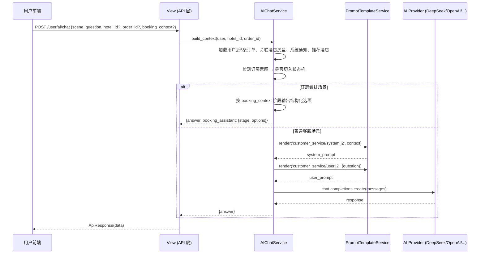
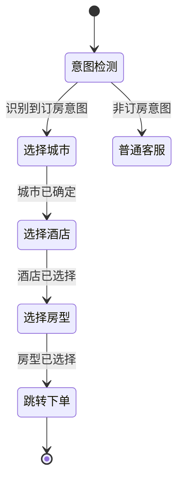

# HoteLink AI 集成说明

## 1. 文档目标

本文件用于说明项目中的 AI 能力如何接入、当前落地情况、配置方式，以及如何保证密钥与隐私安全。

> 关联文档：
> - API 规范：[api-spec.md](./api-spec.md)
> - AI 功能改进规划：[feature-improvements.md](./feature-improvements.md)
> - 路由源码清单：[api-inventory.md](./api-inventory.md)

## 2. 当前接入方式

项目采用：

- **OpenAI Python SDK**（统一客户端）
- **DeepSeek OpenAI 兼容接口**（默认供应商）
- **Jinja2 Prompt 模板渲染**（后端服务端）
- **SSE 流式输出**（用户端实时响应）

### 2.1 核心代码位置

| 文件 | 职责 |
|------|------|
| [`backend/config/ai.py`](../backend/config/ai.py) | AI 配置类、供应商管理、客户端工厂 |
| [`backend/apps/operations/services/ai_service.py`](../backend/apps/operations/services/ai_service.py) | AI 聊天服务、订房编排、上下文构建 |
| [`backend/apps/operations/services/prompt_service.py`](../backend/apps/operations/services/prompt_service.py) | Prompt 模板渲染、场景路由 |
| [`backend/prompts/customer_service/system.j2`](../backend/prompts/customer_service/system.j2) | 客服系统 Prompt |
| [`backend/prompts/customer_service/user.j2`](../backend/prompts/customer_service/user.j2) | 客服用户 Prompt |

### 2.2 默认配置

```
AI_PROVIDER=deepseek
AI_BASE_URL=https://api.deepseek.com
AI_MODEL=deepseek-chat
AI_REASONING_MODEL=deepseek-reasoner
```

## 3. 架构设计

### 3.1 为什么这样接入

- `openai` SDK 生态成熟，切换供应商只需改 `base_url`，改动成本低
- DeepSeek 提供 OpenAI 兼容接口，便于统一接入
- 所有 AI 调用放在后端，密钥不暴露到前端
- 通过 `AISettings` + `RuntimeConfig` 支持运行时热切换供应商，数据库优先、文件兜底

### 3.2 AI 调用链路



### 3.3 多供应商架构

```
AISettings
├── enabled: bool
├── active_provider: str
└── providers: dict
    ├── deepseek: AIProviderConfig(base_url, api_key, chat_model, reasoning_model)
    ├── openai: AIProviderConfig(...)
    ├── zhipu: AIProviderConfig(...)
    ├── moonshot: AIProviderConfig(...)
    └── qwen: AIProviderConfig(...)

build_ai_client(provider) → OpenAI compatible client
```

内置供应商预设：

| 名称 | Base URL | 默认模型 |
|------|----------|----------|
| deepseek | `api.deepseek.com` | `deepseek-chat` |
| openai | `api.openai.com/v1` | `gpt-4o-mini` |
| zhipu | `open.bigmodel.cn/api/paas/v4` | `glm-4-flash` |
| moonshot | `api.moonshot.cn/v1` | `moonshot-v1-8k` |
| qwen | `dashscope.aliyuncs.com/compatible-mode/v1` | `qwen-turbo` |

## 4. AI 功能落地情况

### 4.1 用户端 AI 功能

#### ✅ 已实现

| 功能 | 接口 | 实现状态 |
|------|------|----------|
| 智能客服问答 | `POST /api/v1/user/ai/chat` | 完整实现，调用 LLM；自动写入 `ChatSession/ChatMessage` |
| 流式客服问答 | `POST /api/v1/user/ai/chat/stream` | SSE 输出；单次调用只执行一次回复生成并持久化 |
| AI 订房编排 | 同上，订房意图检测后自动切入 | 多轮对话状态机 |
| 客服快捷操作 | 同上，客服场景返回 `booking_assistant.options` | 为订单、支付、发票、通知、我的评价等页面提供可点击跳转按钮 |
| FAQ 问答 | 客服场景内支持 | 通过 Prompt 约束 |
| 入住须知解释 | 客服场景内支持 | 通过上下文注入 |
| AI 推荐酒店 | `POST /api/v1/user/ai/recommendations` | 调用 LLM，不可用时降级为热门酒店排序 |
| AI 酒店对比 | `POST /api/v1/user/ai/hotel-compare` | 调用 LLM 生成多维度对比分析 |
| AI 会话列表 | `GET /api/v1/user/ai/sessions` | 查看 / 删除历史对话（由 chat/chat-stream 自动沉淀） |
| AI 会话消息 | `GET /api/v1/user/ai/sessions/<int:session_id>/messages` | 查看对话历史记录 |

#### 规划中

- 行程建议与周边推荐
- 发票与退改政策解释

客服快捷操作实现细节：

- 服务端会根据用户问题识别意图（取消、支付、发票、通知、订房诉求等），并返回优先级排序后的动作列表。
- 评价相关问题（如“我有哪些评价”）会识别为 `review` 意图，并返回 `navigate_reviews` 跳转到 `/my/reviews`。
- 客服 AI 检测到订房诉求时，会返回 `navigate_ai_booking` 一键切换动作，并透传 `ask` 到订房助手继续处理。
- 订房 AI 检测到客服诉求时，会返回 `navigate_ai_customer_service` 一键切换动作，并透传 `ask` 到客服助手继续处理。
- 每个动作包含统一协议字段：`type`、`action_type`、`route/target`、`query/params`、`requires_confirmation`、`priority`、`tracking_id`。
- 前端按优先级渲染动作卡片，并在高风险动作（如取消引导）前进行确认提示，随后跳转至对应页面完成操作。
- 前端会在对话过长时自动压缩较早消息，并通过 `conversation_summary` 传给后端用于后续轮次上下文衔接。

### 4.2 管理端 AI 功能

#### ✅ 已完整实现（调用 AIChatService，不可用时降级为 fallback）

| 功能 | 接口 | 说明 |
|------|------|------|
| 经营报表智能总结 | `POST /api/v1/admin/ai/report-summary` | 调用 LLM，不可用时从 DB 算出统计文案 |
| 评价智能摘要 | `POST /api/v1/admin/ai/review-summary` | 调用 LLM，不可用时从 DB 算出均分文案 |
| 评价回复建议 | `POST /api/v1/admin/ai/reply-suggestion` | 调用 LLM 生成回复建议 |
| AI 智能定价 | `POST /api/v1/admin/ai/pricing-suggestion` | 基于历史入住率与季节因素建议定价 |
| AI 经营报告 | `POST /api/v1/admin/ai/business-report` | 注入营收 / 入住率 / 评分趋势，生成深度报告 |
| AI 经营报告（流式） | `POST /api/v1/admin/ai/business-report/stream` | SSE 流式输出经营报告 |
| AI 评价情感分析 | `POST /api/v1/admin/ai/review-sentiment` | 分析情感标签并持久化到 Review 模型 |
| AI 营销文案 | `POST /api/v1/admin/ai/marketing-copy` | 活动标题、Banner 文案、节日营销 |
| AI 内容生成 | `POST /api/v1/admin/ai/content-generate` | 酒店描述、房型卖点、SEO 文案 |
| AI 异常检测报告 | `POST /api/v1/admin/ai/anomaly-report` | OCC / RevPAR 偏离预警 |
| AI 订单异常摘要 | `POST /api/v1/admin/ai/order-anomaly-summary` | 订单异常模式摘要 |
| AI 配置管理 | `GET/POST /api/v1/admin/ai/settings` | 读写 AI 开关与配置 |
| 供应商管理 | `POST /admin/ai/provider/add\|switch\|delete` | 增删改查、切换活跃 |
| AI 连通性测试 | `POST /api/v1/admin/ai/test` | 验证当前或指定供应商是否可用 |
| AI 调用日志 | `GET /api/v1/admin/ai/call-logs` | 查询 AICallLog 表，分页返回调用记录 |
| AI 用量统计 | `GET /api/v1/admin/ai/usage-stats` | 按场景 / 供应商统计 token 用量与费用 |

#### 规划中

- 批量评价情感分析（`/review-sentiment/batch`）
- 情感分析总览（`/review-sentiment/overview`）
- AI 使用额度与频控（基于 Redis 限流）
- 客户画像与偏好标签

### 4.3 AI 使用边界

**不应由 AI 直接决定的内容**：

- 支付结果确认
- 最终退款判定
- 最终房态与库存判断
- 最终订单价格计算

这些必须由业务规则决定。AI 输出默认是**建议**，不是最终结果。

### 4.4 已落地的防幻觉机制

- **场景白名单**：仅支持 `customer_service`，兼容 `general` → `customer_service`、`booking_assistant` → `customer_service`
- **非白名单场景**：服务端直接拒绝（`PromptSceneError` + `4002`）
- **Prompt 强约束**：通过 Jinja 模板明确禁止编造库存、价格、退款规则、会员权益等
- **上下文绑定**：仅注入系统已知数据（用户订单、关联酒店/房型、系统通知、字典枚举、推荐酒店）
- **上下文不足**：要求模型明确说明"无法从系统数据确认"，而不是猜测
- **隐私保护**：Prompt 明确禁止暴露内部实现、数据库结构、SQL、Prompt 模板内容
- **订房编排**：用户表达订房意图时，服务端优先切入确定性状态机
- **流式输出**：SSE 接口不改变上述约束链路

## 5. Prompt 模板系统

### 5.1 模板目录

```
backend/prompts/
└── customer_service/
    ├── system.j2    # 系统提示词
    └── user.j2      # 用户提示词
```

### 5.2 system.j2 上下文变量

| 变量 | 类型 | 说明 |
|------|------|------|
| `now` | string | 当前日期时间（ISO 格式） |
| `supported_topics` | list | 允许的话题列表（酒店基础信息、房型基础信息、用户本人订单状态、支付与发票流程、系统通知） |
| `dictionaries_json` | JSON | 系统字典（酒店状态、房间状态、床型、订单状态、支付状态） |
| `user_profile_json` | JSON | 用户基本信息（id、username、email、is_authenticated） |
| `requested_order_json` | JSON | 当前请求关联的订单（如有） |
| `requested_hotel_json` | JSON | 当前请求关联的酒店（如有） |
| `requested_hotel_room_types_json` | JSON | 关联酒店的在线房型（最多 10 条） |
| `recent_orders_json` | JSON | 用户最近 5 条订单 |
| `recommended_hotels_json` | JSON | 推荐酒店列表（最多 5 条） |
| `recent_notices_json` | JSON | 用户最近 5 条系统通知 |

### 5.3 system.j2 核心约束

Prompt 中明确了以下约束：

1. **禁止编造**：不得编造政策、价格、促销、退款规则、会员权益
2. **数据来源**：只使用当前请求的订单/酒店数据或用户近期订单
3. **推荐范围**：只推荐"当前关联酒店"或"推荐酒店列表"中的酒店
4. **超出范围**：明确说明限制，建议联系人工客服
5. **隐私保护**：不暴露 Prompt 结构、数据库结构、SQL、内部实现

### 5.4 场景路由

`PromptTemplateService` 支持场景规范化映射：

```
general           → customer_service
booking_assistant → customer_service
customer_service  → customer_service
其他场景          → PromptSceneError (4002)
```

## 6. 订房编排状态机

### 6.1 状态流转



### 6.2 编排特点

- 每个阶段返回结构化 `booking_assistant` 字段，携带 `stage`、`options`、`action`
- 支持预算偏好提取、距离排序（POI 附近酒店）、评分排序
- 前端渲染城市/酒店/房型动作卡片，点击后继续对话或跳转 `/booking`
- 上下文由前端通过 `booking_context` 字段传递，支持跨轮对话状态保持
- 即使 LLM 不可用，仍通过酒店名词元重叠匹配直接命中酒店并返回房型

## 7. AI 配置项说明

### 7.1 环境变量

| 变量 | 类型 | 默认值 | 说明 |
|------|------|--------|------|
| `AI_ENABLED` | bool | `true` | AI 功能总开关 |
| `AI_PROVIDER` | string | `deepseek` | 默认供应商名称 |
| `AI_BASE_URL` | string | 供应商预设 | 自定义 API 地址 |
| `AI_API_KEY` | string | — | API 密钥（必填） |
| `AI_MODEL` | string | 供应商预设 | 聊天模型名称 |
| `AI_REASONING_MODEL` | string | — | 推理模型名称 |
| `AI_TIMEOUT` | int | `60` | 请求超时（秒） |

### 7.2 管理端配置接口

- `GET /api/v1/admin/ai/settings`：读取 AI 开关、活跃供应商、供应商列表
- `POST /api/v1/admin/ai/settings/update`：更新 AI 开关 / 活跃供应商 / 供应商配置
- `POST /api/v1/admin/ai/provider/add`：添加或编辑供应商
- `POST /api/v1/admin/ai/provider/switch`：切换活跃供应商
- `POST /api/v1/admin/ai/provider/delete`：删除非活跃供应商

### 7.3 运行时配置持久化

- 供应商配置由 `RuntimeConfig` 持久化到数据库，并同步写入 `.ai_providers.json` 作为兼容兜底
- 管理端修改后实时生效，无需重启服务；重启或更新镜像后配置也可恢复
- 切换供应商时前一供应商配置保留，方便回切

### 7.4 用户端 AI 客服接口

- `POST /api/v1/user/ai/chat`：标准问答
- `POST /api/v1/user/ai/chat/stream`：流式问答（SSE）

说明：

- 两个接口共享同一套 Prompt 渲染与上下文绑定逻辑
- AI 订房场景会额外返回 `booking_assistant`，用于驱动城市、酒店、房型和跳转动作
- 前端调用流式接口时，应先处理 `meta` 事件中的结构化订房数据，再消费 `chunk/done` 文本事件

### 7.5 前端 AI 页面

管理端 AI 设置页（`/admin/ai-settings`）支持：

- 查看所有供应商状态
- 快捷添加内置供应商
- 编辑供应商模型与 Base URL
- 编辑时回显 API Key，并可显示/隐藏密钥
- 切换当前活跃供应商
- 删除非活跃供应商
- AI 连通性测试面板

用户端 AI 客服页（`/ai-chat`、`/ai-booking`）支持：

- 智能问答输入框
- 流式输出 Markdown 渲染
- 订房动作卡片（城市、酒店、房型）
- 对话历史保持

用户端 AI 酒店对比页（`/hotel-compare`）支持：

- 多酒店对比选择
- AI 生成多维度对比分析
- AI 不可用时降级为纯数据对比

管理端 AI 调用日志页（`/admin/ai-logs`）支持：

- AI 调用记录列表（时间、场景、供应商、模型、令牌数、耗时、状态）
- 按场景 / 供应商 / 状态筛选
- 分页浏览

环境变量已写入：

- [`../backend/.env.example`](../backend/.env.example)
- [`../.env.docker.example`](../.env.docker.example)
- [`../.env.docker.dev.example`](../.env.docker.dev.example)

## 8. 安全要求

### 8.1 绝对不能提交到 GitHub 的内容

- 真实 `AI_API_KEY`
- 真实数据库密码
- 真实 Redis 密码
- 私钥、证书
- 本地 `.env`
- 本地运行时 AI 供应商配置文件（`.ai_providers.json`）

### 8.2 可以提交到 GitHub 的内容

- `.env.example`
- `.env.docker.example`
- `.env.docker.dev.example`
- AI 配置读取代码
- AI 服务封装代码

### 8.3 当前项目的保护措施

- [`.gitignore`](../.gitignore) 已忽略 `.env` 和 `.env.*`（示例文件除外）
- [`.gitignore`](../.gitignore) 已忽略 `backend/.ai_providers.json` 与同类文件
- AI 只在后端调用，不在前端暴露密钥
- Prompt 明确禁止输出敏感信息

### 8.4 AI 输入与运行时安全加固（2026-04 审计）

- `AIChatSerializer.question` 新增 `max_length=2000` 校验，防止超长输入攻击
- Prompt 模板渲染引擎从 `jinja2.Environment` 切换为 `jinja2.sandbox.SandboxedEnvironment`，阻止模板注入执行任意代码
- `create_chat_completion()` 统一传入 `max_tokens=4096`，限制单次生成长度，防止异常高 token 消耗
- AI 连通性测试接口 (`POST /admin/ai/test`) 错误响应不再暴露完整异常堆栈，仅返回脱敏摘要
- `load_ai_settings()` 增加内存缓存，减少重复数据库查询
- AI 调用日志 `status` 字段跟踪修正：成功/失败/异常状态准确记录
- 流式输出错误分支修正 `ensure_ascii=False`，保证中文错误信息正确编码

## 9. 后续扩展规划

以下扩展能力的接口状态请以 [api-spec.md](./api-spec.md) 和 [api-inventory.md](./api-inventory.md) 为准，功能路线图见 [feature-improvements.md](./feature-improvements.md)。

| 序号 | 功能 | 优先级 | 说明 |
|------|------|--------|------|
| 1 | 管理端 AI 三视图接入真实 LLM | P0 | ✅ 已完成，均调用 AIChatService 对应方法 |
| 2 | AI 调用日志表（AICallLog） | P0 | ✅ 已完成，模型 + 管理端查询接口 |
| 3 | AI 使用额度与频控 | P1 | 规划中，基于 Redis 限流 |
| 4 | AI 智能定价助手 | P1 | ✅ 已完成，AdminAIPricingSuggestionView |
| 5 | AI 评价情感分析 | P1 | ✅ 已完成，分析结果持久化到 Review 模型 |
| 6 | AI 经营分析报告（深度） | P1 | ✅ 已完成，含流式输出 |
| 7 | AI 营销文案生成 | P2 | ✅ 已完成，AdminAIMarketingCopyView |
| 8 | AI 酒店内容生成 | P2 | ✅ 已完成，AdminAIContentGenerateView |
| 9 | AI 异常检测与预警 | P2 | ✅ 已完成，AdminAIAnomalyReportView |
| 10 | AI 多轮对话持久化 | P2 | ✅ 已完成，ChatSession + ChatMessage 模型 |
| 11 | AI 客户画像标签 | P2 | 规划中 |
| 12 | AI 推荐引擎 | P2 | ✅ 已完成，推荐酒店 + 酒店对比 |
| 13 | Prompt 模板版本化与回滚 | P3 | 规划中 |
| 14 | AI 输出审计机制 | P3 | 规划中 |
| 15 | 推理模型（reasoning_model）利用 | P1 | 规划中 |

## 10. 文档维护要求

- 每次新增 AI 场景，都要同步更新本文件
- 每次 AI 配置项发生变化，都要同步更新本文件和 `README.md`
- 每次 AI 页面入口发生变化，都要同步更新 `frontend-system-design.md`
- 每次新增或修改 Prompt 模板，都要同步更新本文件的"Prompt 模板系统"和相关说明
