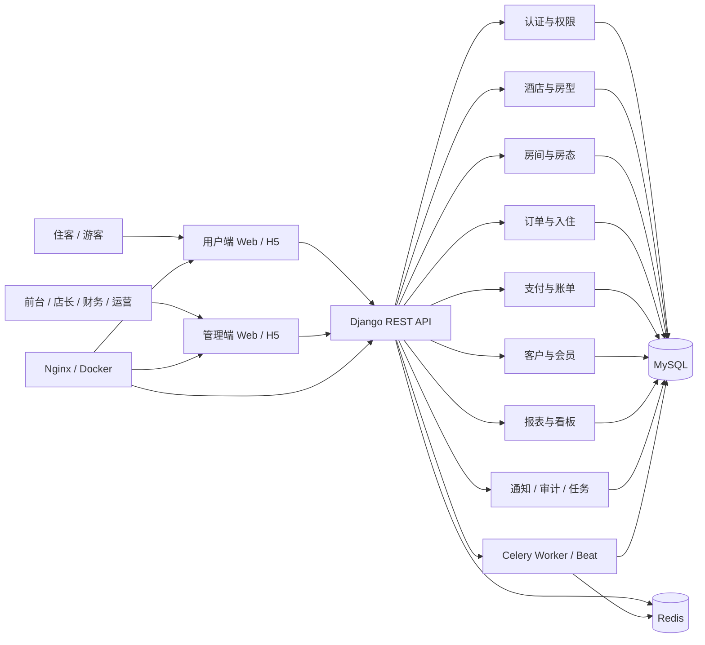
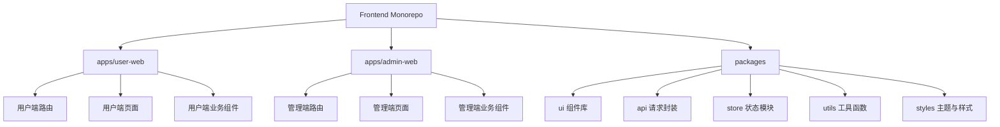
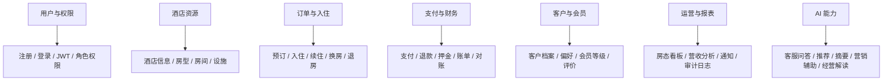
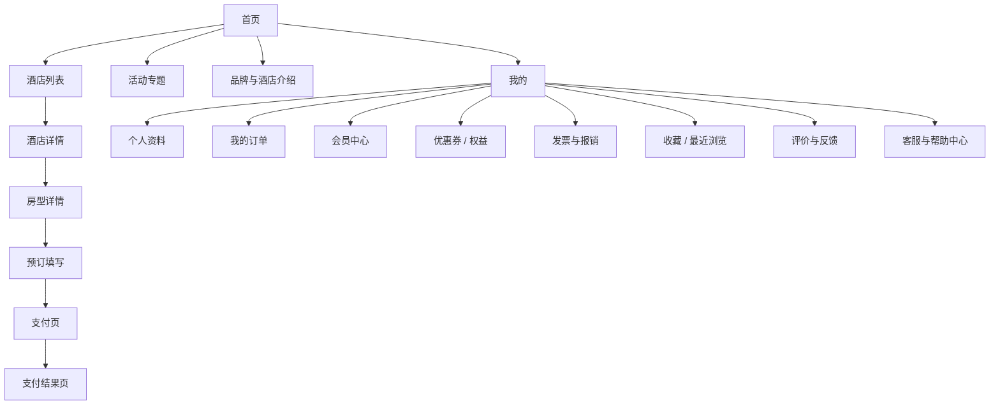
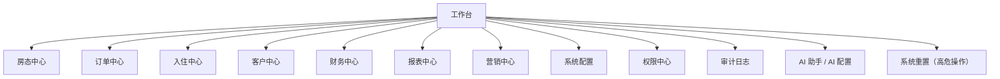
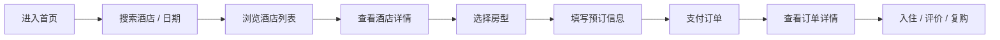
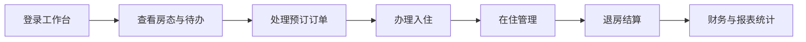

# HoteLink 系统架构与前端界面设计说明

## 1. 文档目标

本文件用于明确 HoteLink 酒店管理系统的：

- 系统整体架构
- 前端应用分层
- 用户端界面清单
- 管理端界面清单
- 核心交互流程
- 现代化酒店网站与酒店管理系统应具备的能力

> 关联文档：
> - 接口设计：[api-spec.md](./api-spec.md)
> - 技术架构：[architecture.md](./architecture.md)
> - AI 集成：[ai-integration.md](./ai-integration.md)
> - 功能规划：[feature-improvements.md](./feature-improvements.md)

> 状态说明（2026-04-13）：本文件包含“已实现 + 设计中”两类内容。路由与接口的最新实现口径请同时参考 [source-of-truth.md](./source-of-truth.md) 与 [api-inventory.md](./api-inventory.md)。

实现状态标记：已实现 = 页面与路由均已落地，设计中 = 仅有设计规划

说明：

- 本文档以论文主线功能为基础
- AI、Docker、工程增强能力会以“扩展功能”形式补充，不替代论文核心业务闭环

## 2. 系统整体定位

HoteLink 不是单一的酒店官网，而是一个完整的酒店数字化系统，包含两大前端应用：

- 用户端：面向住客，完成浏览、预订、支付、订单管理和会员服务
- 管理端：面向酒店员工和管理人员，完成运营、房态、订单、入住退房、财务、报表与配置

系统同时支持：

- PC 端
- 移动端

系统需要兼顾两类目标：

- 对外要像一个现代化酒店官网与订房平台
- 对内要像一个高效率的酒店运营工作台

## 3. 系统总架构图



## 4. 前端应用架构图



## 5. 业务域架构图



## 6. 前端信息架构

### 6.1 用户端信息架构



### 6.2 管理端信息架构



## 7. 用户端界面设计清单

> **用户端页面实现总览（25 路由 / 24 视图）**
>
> | # | 设计页面 | 路由 | 视图文件 | 状态 |
> |---|---------|------|---------|------|
> | 1 | 首页 | `/` | `HomeView.vue` | ✅ 已实现 |
> | 2 | 酒店列表页 | `/hotels` | `HotelListView.vue` | ✅ 已实现 |
> | 3 | 酒店详情页 | `/hotels/:id` | `HotelDetailView.vue` | ✅ 已实现 |
> | 4 | 房型详情页 | — | — | 📐 设计中（合并在酒店详情页内） |
> | 5 | 预订填写页 | `/booking` | `BookingView.vue` | ✅ 已实现 |
> | 6 | 支付页 | `/payment/:orderId` | `PaymentView.vue` | ✅ 已实现 |
> | 7 | 支付结果页 | `/payment/result/:orderId` | `PaymentResultView.vue` | ✅ 已实现 |
> | 8 | 登录 / 注册页 | `/login` `/register` | `LoginView.vue` `RegisterView.vue` | ✅ 已实现 |
> | 9 | 我的首页 | `/my` | `MyView.vue` | ✅ 已实现 |
> | 10 | 我的订单页 | `/my/orders` | `OrderListView.vue` | ✅ 已实现 |
> | 11 | 订单详情页 | `/my/orders/:id` | `OrderDetailView.vue` | ✅ 已实现 |
> | 12 | 个人资料页 | `/my/profile` | `ProfileView.vue` | ✅ 已实现 |
> | 13 | 会员中心页 | `/my/membership` | `MembershipView.vue` | ✅ 已实现 |
> | 14 | 优惠券与权益页 | `/my/coupons` | `CouponListView.vue` | ✅ 已实现 |
> | 15 | 发票管理页 | `/my/invoices` | `InvoiceView.vue` | ✅ 已实现 |
> | 16 | 收藏与浏览记录页 | `/my/favorites` | `FavoriteListView.vue` | ✅ 已实现 |
> | 17 | 评价与反馈页 | `/my/reviews` | `ReviewListView.vue` | ✅ 已实现 |
> | 18 | 帮助中心 | `/help` | `HelpView.vue` | ✅ 已实现 |
> | 19 | AI 智能客服页 | `/ai-chat` `/ai-booking` | `AIChatView.vue` | ✅ 已实现 |
> | 20 | 品牌故事页 | `/about` | `AboutView.vue` | ✅ 已实现 |
> | 21 | 活动专题页 | — | — | 📐 设计中 |
> | 22 | 联系我们页 | `/contact` | `ContactView.vue` | ✅ 已实现 |
> | 23 | AI 酒店对比页 | `/hotel-compare` | `HotelCompareView.vue` | ✅ 已实现 |
> | — | 通知中心 | `/my/notifications` | `NotificationView.vue` | ✅ 已实现 |
> | — | 404 页 | `/404` | `NotFoundView.vue` | ✅ 已实现 |

用户端既要满足“官网展示”，也要满足“预订闭环”。建议以移动优先，但 PC 端必须具有完整浏览和下单体验。

### 7.1 公共与基础页面

#### 1. 首页

核心模块：

- 顶部导航
- 品牌主视觉 Banner
- 入住/离店日期搜索
- 酒店或城市搜索
- 热门房型推荐
- 优惠活动专区
- 酒店亮点与设施介绍
- 用户评价精选
- 地图位置与交通信息
- 底部帮助与品牌信息

设计要求：

- 首屏需要强烈的预订转化能力
- 图片、价格、评分、位置要清晰
- PC 端强调视觉沉浸感，移动端强调快速搜索和触达
- 设计主要侧重移动端为主

#### 2. 酒店列表页

核心模块：

- 关键词搜索
- 城市 / 商圈 / 景点筛选
- 价格区间筛选
- 星级 / 评分筛选
- 设施筛选
- 排序
- 地图与列表切换
- 酒店卡片列表

设计要求：

- 支持卡片视图和地图视图
- 支持移动端筛选抽屉
- 突出酒店图片、位置、价格、评分、标签

#### 3. 酒店详情页

核心模块：

- 酒店大图轮播
- 酒店简介
- 地图位置
- 周边交通与景点
- 设施与服务
- 房型列表
- 入住政策
- 用户评价
- 常见问题

设计要求：

- 要有营销感，也要有决策信息
- 房型列表需要直接承接预订动作

#### 4. 房型详情页

核心模块：

- 房型图片
- 面积 / 床型 / 早餐 / 可住人数
- 价格日历
- 取消政策
- 库存状态
- 可选附加服务
- 立即预订按钮

设计要求：

- 突出价格透明度和库存感
- 支持日期切换后实时展示价格变化

### 7.2 预订与支付流程页面

#### 5. 预订填写页

核心模块：

- 入住与离店日期
- 房型摘要
- 入住人数
- 入住人信息
- 联系人信息
- 发票需求
- 优惠券选择
- 备注与特殊需求
- 订单金额明细

设计要求：

- 表单步骤要清晰
- 支持移动端分段填写
- 金额构成必须透明

#### 6. 支付页

核心模块：

- 订单信息确认
- 支付方式选择
- 应付金额
- 优惠抵扣
- 支付倒计时

设计要求：

- 支付操作路径短
- 风险信息和取消规则清晰

#### 7. 支付结果页

核心模块：

- 支付成功 / 失败状态
- 订单号
- 入住信息摘要
- 查看订单按钮
- 联系酒店按钮

### 7.3 用户中心页面

#### 8. 登录 / 注册页

核心模块：

- 手机号登录
- 密码登录
- 验证码登录
- 注册
- 忘记密码
- 协议确认

设计要求：

- 支持快捷登录
- 尽量减少注册阻力

#### 9. 我的首页

核心模块：

- 用户头像与昵称
- 会员等级
- 待支付 / 待入住 / 已完成订单入口
- 优惠券入口
- 发票入口
- 收藏与最近浏览

#### 10. 我的订单页

核心模块：

- 关键词搜索（订单号 / 酒店 / 房型 / 入住人 / 手机号）
- 高级筛选（支付状态、入住日期区间、下单日期区间、金额区间）
- 订单状态标签
- 订单卡片
- 取消订单
- 再次预订
- 联系酒店

交互补充：

- 搜索与筛选条件会同步到 URL query，支持刷新恢复、链接分享与从通知页回跳后保留条件。

#### 11. 订单详情页

核心模块：

- 订单状态时间线
- 酒店与房型信息
- 入住人信息
- 费用明细
- 支付信息
- 退款信息
- 发票状态

#### 12. 个人资料页

核心模块：

- 基本信息
- 联系方式
- 常用入住人
- 偏好设置

#### 13. 会员中心页

核心模块：

- 会员等级
- 成长值
- 可用权益
- 会员专属价格
- 升级说明

#### 14. 优惠券与权益页

核心模块：

- 可用优惠券
- 已使用优惠券
- 已过期优惠券
- 权益包

#### 15. 发票管理页

核心模块：

- 发票抬头
- 发票记录
- 开票申请

#### 16. 收藏与浏览记录页

核心模块：

- 收藏酒店
- 最近浏览
- 一键再次搜索

#### 17. 评价与反馈页

核心模块：

- 待评价订单
- 已评价列表
- 图文评价
- 服务反馈

#### 18. 帮助中心 / 在线客服页

核心模块：

- 常见问题
- 联系方式
- 在线客服入口
- 投诉建议

#### 19. AI 智能客服页

核心模块：

- 智能问答输入框
- 常见问题快捷入口
- 订单相关快捷问题
- 酒店规则解释
- 转人工入口

交互补充：

- 客服场景会根据当前订单与通知上下文返回快捷操作按钮，可一键跳转到我的订单、订单详情、支付页、发票中心、通知中心等页面。
- 订房场景继续使用结构化推荐选项，用于城市、酒店、房型等多步选择。

#### 通知中心补充（用户端）

- 订单/支付通知优先直达对应订单详情页（`/my/orders/:id`）。
- 若历史通知缺失关联订单字段，则降级跳转到 `/my/orders` 并自动带 `keyword` 进行定位。

设计要求：

- 以“辅助答疑”为主
- 对高风险问题要给出“以酒店规则和订单实际状态为准”的提示

### 7.4 内容与品牌页面

#### 20. 品牌故事页

核心模块：

- 品牌介绍
- 酒店风格
- 服务理念

#### 21. 活动专题页

核心模块：

- 节日活动
- 套餐促销
- 限时优惠

#### 22. 联系我们页

核心模块：

- 门店地址
- 电话
- 地图
- 邮箱

#### 23. AI 酒店对比页

核心模块：

- 选择多家酒店进行对比
- AI 生成对比分析（价格、位置、评分、设施等维度）
- 对比结果可视化展示

设计要求：

- AI 不可用时降级为纯数据对比
- 对比维度要清晰、可快速辅助决策

## 8. 管理端界面设计清单

> **管理端页面实现总览（20 路由 / 19 视图）**
>
> | # | 设计页面 | 路由 | 视图文件 | 状态 |
> |---|---------|------|---------|------|
> | 1 | 登录页 | `/admin/login` | `LoginView.vue` | ✅ 已实现 |
> | 2 | 工作台 / 首页 | `/admin` | `DashboardView.vue` | ✅ 已实现 |
> | 3 | 房态总览页 | `/admin/inventory` | `InventoryView.vue` | ✅ 已实现（库存/房态合一） |
> | 3.5 | 酒店管理页 | `/admin/hotels` | `HotelListView.vue` | ✅ 已实现 |
> | 4 | 房型管理页 | `/admin/room-types` | `RoomTypeListView.vue` | ✅ 已实现 |
> | 5 | 房间管理页 | — | — | 📐 设计中 |
> | 6 | 设施与服务配置页 | — | — | 📐 设计中 |
> | 7 | 订单管理页 | `/admin/orders` | `OrderListView.vue` | ✅ 已实现 |
> | 8 | 订单详情页 | `/admin/orders/:id` | `OrderDetailView.vue` | ✅ 已实现 |
> | 9 | 新建预订页 | — | — | 📐 设计中 |
> | 10 | 入住办理页 | — | — | 📐 设计中 |
> | 11 | 退房结算页 | — | — | 📐 设计中 |
> | 12 | 续住 / 换房页 | — | — | 📐 设计中 |
> | 13 | 取消与退款处理页 | — | — | 📐 设计中 |
> | 14 | 客户档案页 | `/admin/users` | `UserListView.vue` | ✅ 已实现（用户列表） |
> | 15 | 会员管理页 | `/admin/members` | `MemberManageView.vue` | ✅ 已实现 |
> | 16 | 评价与反馈管理页 | `/admin/reviews` | `ReviewListView.vue` | ✅ 已实现 |
> | 17 | 财务总览页 | — | — | 📐 设计中 |
> | 18 | 账单管理页 | — | — | 📐 设计中 |
> | 19 | 支付记录页 | — | — | 📐 设计中 |
> | 20 | 退款记录页 | — | — | 📐 设计中 |
> | 21 | 经营报表页 | `/admin/reports` | `ReportView.vue` | ✅ 已实现 |
> | 22 | 活动管理页 | — | — | 📐 设计中 |
> | 23 | 优惠券管理页 | `/admin/coupons` | `CouponManageView.vue` | ✅ 已实现 |
> | 24 | 内容管理页 | — | — | 📐 设计中 |
> | 25 | 员工管理页 | `/admin/employees` | `EmployeeListView.vue` | ✅ 已实现 |
> | 26 | 角色权限页 | — | — | 📐 设计中 |
> | 27 | 系统配置页 | `/admin/settings` | `SettingsView.vue` | ✅ 已实现（含系统重置） |
> | 28 | 通知中心页 | — | — | 📐 设计中 |
> | 29 | 审计日志页 | — | — | 📐 设计中 |
> | 30 | AI 助手工作台 | `/admin/ai` | `AIAssistantView.vue` | ✅ 已实现 |
> | 31 | AI 配置页 | `/admin/ai-settings` | `AISettingsView.vue` | ✅ 已实现 |
> | 32 | AI 调用日志页 | `/admin/ai-logs` | `AICallLogsView.vue` | ✅ 已实现 |
> | 33 | AI 经营分析页 | — | — | 📐 设计中（部分在报表页内） |
> | 34 | AI 客服辅助页 | — | — | 📐 设计中 |
> | — | 初始化设置页 | `/admin/setup` | `InitSetupView.vue` | ✅ 已实现（文档未列设计） |
> | — | 404 页 | `/admin/404` | `NotFoundView.vue` | ✅ 已实现 |

补充（2026-04）：

- `OrderListView.vue`、`UserListView.vue`、`EmployeeListView.vue`、`ReportView.vue` 已统一接入可复用排序交互：顶部排序下拉 + `DataTable` 表头排序双向同步。
- 上述页面列表请求均透传 `ordering` 参数，与后端白名单排序保持一致。

管理端要体现“高效率”“强信息密度”“可追踪”“权限清晰”。PC 端为主，移动端保留核心快捷操作。

### 8.1 认证与门户

#### 1. 登录页

核心模块：

- 账号密码登录
- 验证码
- 记住登录
- 忘记密码
- 酒店品牌视觉

#### 2. 工作台 / 首页

核心模块：

- 今日入住
- 今日退房
- 待处理订单
- 当前入住率
- 今日营收
- 告警信息
- 快捷操作入口
- 趋势图表

设计要求：

- 这是管理端最核心的总览页
- 要有图表、统计卡片、待办模块和快捷入口

### 8.2 房态与资源管理

#### 3. 房态总览页

核心模块：

- 楼层视图
- 房间状态颜色标签
- 空闲 / 已订 / 在住 / 清扫 / 维修
- 房态筛选
- 房间快捷操作

设计要求：

- 要支持酒店前台快速查看和切换
- 移动端可退化为卡片式房态列表

#### 3.5 酒店管理页

核心模块：

- 酒店列表（含封面图缩略图展示）
- 新建 / 编辑酒店（封面图上传、图片画廊管理）
- 酒店基本信息（名称、城市、地址、星级、电话、描述）
- 酒店状态管理（草稿 / 上架 / 下架）
- 删除酒店

设计要求：

- 图片上传通过通用上传接口（`/api/v1/common/upload`）实现
- 封面图和画廊图片支持预览和删除
- 所有操作通过 Toast 通知反馈成功或失败

#### 4. 房型管理页

核心模块：

- 房型列表（含房型主图缩略图展示）
- 房型价格
- 房型政策
- 房型图片上传与管理（主图上传、预览、删除）
- 上下架状态

#### 5. 房间管理页

核心模块：

- 房间编号
- 楼层
- 房型归属
- 当前状态
- 房间标签

#### 6. 设施与服务配置页

核心模块：

- 酒店设施
- 房型设施
- 增值服务
- 早餐 / 接送 / 延迟退房配置

### 8.3 订单与前台业务

#### 7. 订单管理页

核心模块：

- 订单列表
- 多条件筛选
- 订单状态
- 支付状态
- 渠道来源
- 订单详情抽屉
- 批量操作

#### 8. 订单详情页

核心模块：

- 订单基础信息
- 房型与价格
- 入住人信息
- 支付记录
- 退款记录
- 操作日志

#### 9. 新建预订页

核心模块：

- 客户搜索 / 新增客户
- 日期选择
- 房态联动
- 价格计算
- 押金与支付

#### 10. 入住办理页

核心模块：

- 订单选择
- 客户身份信息录入
- 房间分配
- 押金收取
- 入住确认

#### 11. 退房结算页

核心模块：

- 房间消费明细
- 额外收费
- 押金抵扣
- 发票处理
- 退款或补差

#### 12. 续住 / 换房页

核心模块：

- 日期延长
- 房态检查
- 房间切换
- 差价结算

#### 13. 取消与退款处理页

核心模块：

- 取消原因
- 退款规则
- 审批流程
- 状态追踪

### 8.4 客户与会员管理

#### 14. 客户档案页

核心模块：

- 客户搜索
- 历史入住记录
- 消费记录
- 偏好信息
- 黑名单 / 风险标记

#### 15. 会员管理页

核心模块：

- 会员等级
- 成长值
- 权益配置
- 会员行为分析

#### 16. 评价与反馈管理页

核心模块：

- 评价列表
- 差评告警
- 处理记录
- 回复评价

### 8.5 财务与报表

#### 17. 财务总览页

核心模块：

- 今日营收
- 本月营收
- 退款统计
- 押金统计
- 渠道收入占比

#### 18. 账单管理页

核心模块：

- 账单列表
- 账单详情
- 费用项
- 导出

#### 19. 支付记录页

核心模块：

- 支付流水
- 支付方式
- 对账状态

#### 20. 退款记录页

核心模块：

- 退款流水
- 退款原因
- 审批与执行状态

#### 21. 经营报表页

核心模块：

- 入住率趋势图
- RevPAR / ADR 图表
- 房态利用率
- 客源渠道占比
- 时段分析

设计要求：

- 这里是 ECharts 的主要使用区
- 要支持图表切换、日期区间切换、导出

### 8.6 营销与内容运营

#### 22. 活动管理页

核心模块：

- 活动列表
- 活动时间
- 折扣策略
- 活动适用酒店 / 房型

#### 23. 优惠券管理页

核心模块：

- 券模板
- 发放策略
- 使用规则
- 核销统计

#### 24. 内容管理页

核心模块：

- 首页 Banner
- 酒店介绍内容
- 图文素材
- 活动专题页内容

### 8.7 系统与权限

#### 25. 员工管理页

核心模块：

- 员工账号
- 所属门店
- 状态管理

#### 26. 角色权限页

核心模块：

- 角色列表
- 菜单权限
- 按钮权限
- 数据权限

#### 27. 系统配置页

核心模块：

- 酒店基础配置（平台名称、管理员姓名、客服电话、订单自动取消时间）
- 支付配置
- 发票配置
- 消息配置
- API 配置
- 系统状态监控（Tab 切换：CPU / 内存 / 磁盘环形仪表、数据库 / Redis / Celery 服务状态、业务概览统计）

#### 27.1 系统重置区（高危）

核心模块：

- 危险操作提示
- 输入 `RESET` 二次确认
- 重置进度与结果反馈
- 风险说明与不可逆提示

设计要求：

- 使用红色危险色系强调风险
- 必须有文本确认 + 浏览器二次确认
- 仅系统管理员角色可见

#### 28. 通知中心页

核心模块：

- 站内通知
- 短信任务
- 邮件任务
- 失败重试记录

#### 29. 审计日志页

核心模块：

- 操作人
- 操作模块
- 操作内容
- 时间
- IP

### 8.8 AI 能力与配置

#### 30. AI 助手工作台

核心模块：

- AI 能力总览
- AI 使用量
- 最近 AI 任务
- AI 风险提示

#### 31. AI 配置页

核心模块：

- Provider 列表管理（新增 / 编辑 / 删除）
- 活跃 Provider 切换
- 模型配置
- 超时配置
- 开关控制
- Prompt 模板入口
- AI 连通性测试面板
- API Key 显示/隐藏与编辑回显

说明：

- 页面应以弹窗方式维护 Provider，避免表单拉长主页面
- 页面上仅对管理员回显真实密钥，普通界面不应暴露

#### 32. AI 调用日志页

核心模块：

- AI 调用记录列表（时间、场景、供应商、模型、令牌数、耗时、状态）
- 按场景 / 供应商 / 状态筛选
- 分页浏览

设计要求：

- 信息密度高，适合排查 AI 服务异常
- 失败记录需明显标示错误原因

#### 33. AI 经营分析页

核心模块：

- 营收总结
- 入住率分析
- 差评摘要
- 渠道变化说明

#### 34. AI 客服辅助页

核心模块：

- 常见回复建议
- 投诉回复草稿
- 用户问题摘要
- 人工复核入口

## 9. 核心用户旅程图

### 9.1 用户端预订旅程



### 9.2 管理端前台业务旅程



## 10. 现代酒店网站与系统必须具备的能力

为了满足当前酒店行业的通用需求，前端设计建议必须覆盖以下能力。

### 10.1 用户端必须具备

- 强转化首页
- 酒店与房型高质量展示
- 日期和库存联动
- 价格透明与取消规则清晰
- 在线支付
- 订单状态追踪
- 发票与报销支持
- 会员与优惠券体系
- 评价与反馈机制
- 客服与帮助中心
- 地图与交通信息
- 多端自适应

### 10.2 管理端必须具备

- 工作台总览
- 房态中心
- 订单中心
- 入住退房闭环
- 客户档案
- 财务与账单
- 图表化经营分析
- 角色权限体系
- 审计日志
- 内容与活动运营
- 多门店扩展能力
- AI 辅助运营能力

## 11. AI 功能设计原则

### 11.1 推荐优先落点

- 用户端智能客服
- 用户端推荐助手
- 管理端经营分析
- 管理端差评摘要
- 管理端营销文案辅助

### 11.2 用户端 AI 客服实现现状

- 路由入口：`/ai-chat`
- 前端页面：`AIChatView.vue`
- 调用方式：
- 标准接口：`POST /api/v1/user/ai/chat`
- 流式接口：`POST /api/v1/user/ai/chat/stream`
- 流式协议：SSE，前端先消费 `meta` 事件中的结构化订房数据，再按 `chunk/done` 逐段拼接回答文本
- 展示能力：AI 回复支持 Markdown 渲染（加粗、列表、代码块、引用等）
- 订房交互：支持在聊天消息中直接渲染城市、酒店、房型动作卡片，点击后继续对话或直接跳转 `/booking`
- 客服交互：客服场景支持结构化快捷动作（订单详情、去支付、取消引导、发票、通知、帮助中心、切换订房助手）
- 双向引导：订房助手检测到客服诉求时会返回“切换到 AI 智能客服”按钮；客服检测到订房诉求时会返回“切换到 AI 订房助手”按钮
- 动作协议：前端按 `type/action_type/route/query/requires_confirmation/priority/tracking_id` 渲染与执行，支持优先级排序与确认提示
- 问题续聊：跨助手跳转时通过 `query.ask` 透传原问题，目标页面自动发送该问题并移除一次性参数
- 页面联动：当 AI 动作跳转到订单详情并携带 `source=ai&action=cancel` 时，会自动打开取消弹窗并清理一次性参数

交互原则：

- 优先显示流式回答，降低等待感
- 渲染前进行基础 HTML 转义，避免将原始 HTML 直接注入页面
- 对异常场景保留兜底提示文案，避免界面停留在“加载中”
- 订房上下文由前端随对话一起携带，支持用户先选城市，再选酒店，再一键进入订单填写页

### 11.3 不建议一开始直接交给 AI 的内容

- 最终支付判定
- 最终退款判定
- 最终房态和库存判定
- 最终订单价格计算

### 11.4 设计边界

- AI 输出默认是建议，不是最终系统结果
- 高风险动作必须保留人工复核
- 页面中应明确提示 AI 结果可能存在偏差

## 12. 现代化界面设计原则

### 12.1 用户端视觉方向

- 大图与沉浸感
- 强调品牌与信任感
- 清晰的价格与评分信息
- 预订入口始终可见
- 页面层次简洁、轻量、移动优先

### 12.2 管理端视觉方向

- 信息密度高但不拥挤
- 卡片、表格、图表组合明确
- 状态颜色统一
- 操作路径短
- 抽屉、弹窗、批量操作高效

### 12.3 响应式原则

- 用户端：移动优先，PC 增强内容展示
- 管理端：PC 优先，移动端保留核心操作
- 表格在移动端退化为卡片
- 筛选器在移动端进入抽屉

## 13. 公共组件与交互体系

### 13.1 Toast 通知组件

`packages/ui` 中提供全局 Toast 通知能力，已在所有管理端视图中统一接入：

- **组件**：`Toast.vue` — 支持 `success`、`error`、`warning`、`info` 四种类型，使用 Teleport 挂载，含滑入动画与自动消失
- **Composable**：`useToast()` — 全局状态管理，`showToast(message, type, duration?)` 触发通知

使用方式：

```vue
<script setup>
import { Toast, useToast } from '@hotelink/ui'
const { toastVisible, toastMessage, toastType, showToast, closeToast } = useToast()
</script>
<template>
  <Toast :visible="toastVisible" :message="toastMessage" :type="toastType" @close="closeToast" />
</template>
```

### 13.2 图片上传

- 前端通过 `commonApi.upload(file, scene)` 调用通用上传接口
- 支持场景标识：`hotel`（酒店图片）、`room_type`（房型主图）等
- 上传后返回文件 URL，前端在表单中保存 URL

### 13.3 共享 UI 组件库总览

`packages/ui` 当前提供以下已实现组件：

| 组件 | 说明 |
|------|------|
| `StatCard.vue` | 统计卡片，用于工作台数据展示 |
| `DataTable.vue` | 数据表格，支持 `sortField` 表头排序、`sort-value` 双向绑定与插槽 |
| `ModalDialog.vue` | 模态对话框 |
| `StatusBadge.vue` | 状态徽章（颜色标签） |
| `PageHeader.vue` | 页面标题头部 |
| `EmptyState.vue` | 空状态占位 |
| `Pagination.vue` | 分页组件 |
| `Toast.vue` | 消息提示 |
| `SelectField.vue` | 下拉选择 |
| `ConfirmDialog.vue` | 确认对话框（危险操作二次确认） |
| `OrderStepBar.vue` | 订单状态步骤条（展示订单状态流转进度） |

Composable：

| 名称 | 说明 |
|------|------|
| `useToast()` | 全局 Toast 消息管理 |
| `useConfirm()` | 全局确认弹窗管理 |

### 13.4 API 请求层

`packages/api` 统一封装所有前后端交互，按业务域划分模块：

- **管理端**：`systemApi`、`authApi`、`dashboardApi`、`hotelApi`、`roomTypeApi`、`inventoryApi`、`orderApi`、`reviewApi`、`userApi`、`employeeApi`、`reportApi`、`settingsApi`、`adminSystemApi`（含 `status()` 系统状态监控）、`adminCouponApi`、`adminMemberApi`、`aiApi`、`commonApi`
- **用户端**：`publicApi`、`userAuthApi`、`userProfileApi`、`userOrderApi`、`userReviewApi`、`userFavoriteApi`、`userCouponApi`、`userInvoiceApi`、`userPointsApi`、`userNoticeApi`、`userAiApi`
- **工具**：`getToken`、`setTokens`、`clearTokens`、`getRefreshToken`、`configureApi`

### 13.5 状态管理

`packages/store` 提供跨应用的 Pinia Store：

| Store | 说明 |
|-------|------|
| `useAuthStore` | 管理端登录态（login / logout / fetchMe） |
| `useUserAuthStore` | 用户端登录态（login / register / logout / fetchMe） |
## 14. 当前实现进度与下一步计划

### 14.1 已完成

用户端已实现 22/23 个设计页面（路由 25 条），管理端已实现 15/34 个设计页面（路由 20 条）。

核心闭环（浏览 → 预订 → 支付 → 订单管理 → 评价）已全部落地。

### 14.2 建议下一步优先级

1. **管理端前台业务**：入住办理、退房结算、续住/换房 — 补齐 PMS 核心流程
2. **管理端财务**：财务总览、账单管理、支付记录、退款记录 — 补齐资金链路
3. **管理端运营**：通知中心、审计日志、活动管理 — 补齐运营支撑
4. **管理端权限**：角色权限页、房间管理 — 补齐系统管理
5. **用户端补充**：活动专题页 — 唯一未实现的用户端设计页面

## 15. 文档维护要求

- 新增页面时同步更新本文件的实现总览表和对应设计章节
- 新增 AI 入口时同步更新本文件与 `ai-integration.md`
- 新增导航结构时同步更新信息架构图
- 若页面范围与论文主线发生变化，同步更新 `thesis-alignment.md`
- 新增前端流式协议或渲染策略（如 SSE / Markdown）时，同步更新本文件与 `api-spec.md`
