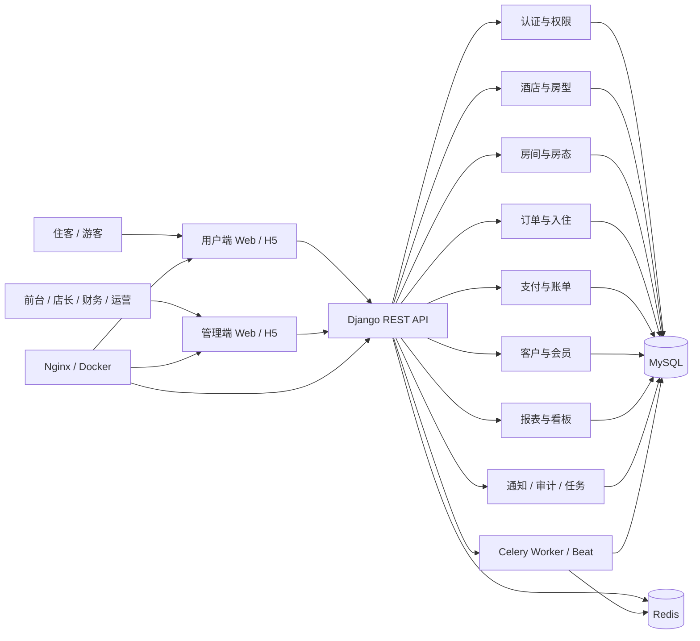
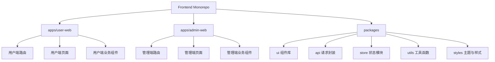
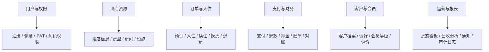
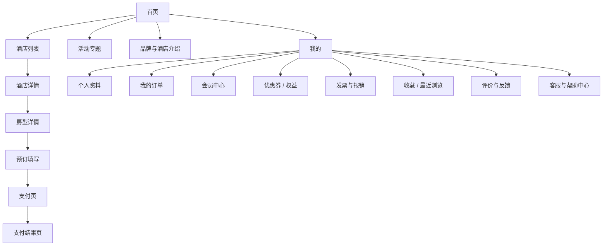
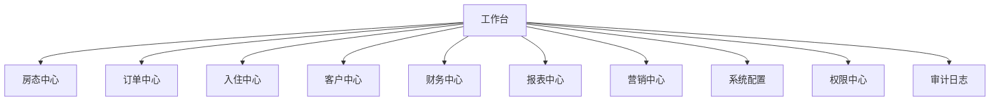
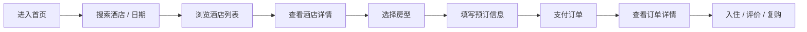
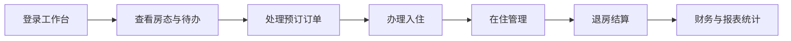

# HoteLink 系统架构与前端界面设计说明

## 1. 文档目标

本文件用于明确 HoteLink 酒店管理系统的：

- 系统整体架构
- 前端应用分层
- 用户端界面清单
- 管理端界面清单
- 核心交互流程
- 现代化酒店网站与酒店管理系统应具备的能力

本说明既服务于产品设计，也服务于后续：

- 页面原型设计
- 路由规划
- 前端组件拆分
- 后端接口设计
- 权限模型设计

## 2. 系统整体定位

HoteLink 不是单一的酒店官网，而是一个完整的酒店数字化系统，包含两大前端应用：

- 用户端：面向住客，完成浏览、预订、支付、订单管理和会员服务
- 管理端：面向酒店员工和管理人员，完成运营、房态、订单、入住退房、财务、报表与配置

系统同时支持：

- PC 端
- 移动端

系统需要兼顾两类目标：

- 对外要像一个现代化酒店官网与订房平台
- 对内要像一个高效率的酒店运营工作台

## 3. 系统总架构图

## 4. 前端应用架构图

## 5. 业务域架构图

## 6. 前端信息架构

### 6.1 用户端信息架构

### 6.2 管理端信息架构

## 7. 用户端界面设计清单

用户端既要满足“官网展示”，也要满足“预订闭环”。建议以移动优先，但 PC 端必须具有完整浏览和下单体验。

### 7.1 公共与基础页面

#### 1. 首页

核心模块：

- 顶部导航
- 品牌主视觉 Banner
- 入住/离店日期搜索
- 酒店或城市搜索
- 热门房型推荐
- 优惠活动专区
- 酒店亮点与设施介绍
- 用户评价精选
- 地图位置与交通信息
- 底部帮助与品牌信息

设计要求：

- 首屏需要强烈的预订转化能力
- 图片、价格、评分、位置要清晰
- PC 端强调视觉沉浸感，移动端强调快速搜索和触达
- 设计主要侧重移动端为主

#### 2. 酒店列表页

核心模块：

- 关键词搜索
- 城市 / 商圈 / 景点筛选
- 价格区间筛选
- 星级 / 评分筛选
- 设施筛选
- 排序
- 地图与列表切换
- 酒店卡片列表

设计要求：

- 支持卡片视图和地图视图
- 支持移动端筛选抽屉
- 突出酒店图片、位置、价格、评分、标签

#### 3. 酒店详情页

核心模块：

- 酒店大图轮播
- 酒店简介
- 地图位置
- 周边交通与景点
- 设施与服务
- 房型列表
- 入住政策
- 用户评价
- 常见问题

设计要求：

- 要有营销感，也要有决策信息
- 房型列表需要直接承接预订动作

#### 4. 房型详情页

核心模块：

- 房型图片
- 面积 / 床型 / 早餐 / 可住人数
- 价格日历
- 取消政策
- 库存状态
- 可选附加服务
- 立即预订按钮

设计要求：

- 突出价格透明度和库存感
- 支持日期切换后实时展示价格变化

### 7.2 预订与支付流程页面

#### 5. 预订填写页

核心模块：

- 入住与离店日期
- 房型摘要
- 入住人数
- 入住人信息
- 联系人信息
- 发票需求
- 优惠券选择
- 备注与特殊需求
- 订单金额明细

设计要求：

- 表单步骤要清晰
- 支持移动端分段填写
- 金额构成必须透明

#### 6. 支付页

核心模块：

- 订单信息确认
- 支付方式选择
- 应付金额
- 优惠抵扣
- 支付倒计时

设计要求：

- 支付操作路径短
- 风险信息和取消规则清晰

#### 7. 支付结果页

核心模块：

- 支付成功 / 失败状态
- 订单号
- 入住信息摘要
- 查看订单按钮
- 联系酒店按钮

### 7.3 用户中心页面

#### 8. 登录 / 注册页

核心模块：

- 手机号登录
- 密码登录
- 验证码登录
- 注册
- 忘记密码
- 协议确认

设计要求：

- 支持快捷登录
- 尽量减少注册阻力

#### 9. 我的首页

核心模块：

- 用户头像与昵称
- 会员等级
- 待支付 / 待入住 / 已完成订单入口
- 优惠券入口
- 发票入口
- 收藏与最近浏览

#### 10. 我的订单页

核心模块：

- 订单筛选
- 订单状态标签
- 订单卡片
- 取消订单
- 再次预订
- 联系酒店

#### 11. 订单详情页

核心模块：

- 订单状态时间线
- 酒店与房型信息
- 入住人信息
- 费用明细
- 支付信息
- 退款信息
- 发票状态

#### 12. 个人资料页

核心模块：

- 基本信息
- 联系方式
- 常用入住人
- 偏好设置

#### 13. 会员中心页

核心模块：

- 会员等级
- 成长值
- 可用权益
- 会员专属价格
- 升级说明

#### 14. 优惠券与权益页

核心模块：

- 可用优惠券
- 已使用优惠券
- 已过期优惠券
- 权益包

#### 15. 发票管理页

核心模块：

- 发票抬头
- 发票记录
- 开票申请

#### 16. 收藏与浏览记录页

核心模块：

- 收藏酒店
- 最近浏览
- 一键再次搜索

#### 17. 评价与反馈页

核心模块：

- 待评价订单
- 已评价列表
- 图文评价
- 服务反馈

#### 18. 帮助中心 / 在线客服页

核心模块：

- 常见问题
- 联系方式
- 在线客服入口
- 投诉建议

### 7.4 内容与品牌页面

#### 19. 品牌故事页

核心模块：

- 品牌介绍
- 酒店风格
- 服务理念

#### 20. 活动专题页

核心模块：

- 节日活动
- 套餐促销
- 限时优惠

#### 21. 联系我们页

核心模块：

- 门店地址
- 电话
- 地图
- 邮箱

## 8. 管理端界面设计清单

管理端要体现“高效率”“强信息密度”“可追踪”“权限清晰”。PC 端为主，移动端保留核心快捷操作。

### 8.1 认证与门户

#### 1. 登录页

核心模块：

- 账号密码登录
- 验证码
- 记住登录
- 忘记密码
- 酒店品牌视觉

#### 2. 工作台 / 首页

核心模块：

- 今日入住
- 今日退房
- 待处理订单
- 当前入住率
- 今日营收
- 告警信息
- 快捷操作入口
- 趋势图表

设计要求：

- 这是管理端最核心的总览页
- 要有图表、统计卡片、待办模块和快捷入口

### 8.2 房态与资源管理

#### 3. 房态总览页

核心模块：

- 楼层视图
- 房间状态颜色标签
- 空闲 / 已订 / 在住 / 清扫 / 维修
- 房态筛选
- 房间快捷操作

设计要求：

- 要支持酒店前台快速查看和切换
- 移动端可退化为卡片式房态列表

#### 4. 房型管理页

核心模块：

- 房型列表
- 房型价格
- 房型政策
- 房型图片
- 上下架状态

#### 5. 房间管理页

核心模块：

- 房间编号
- 楼层
- 房型归属
- 当前状态
- 房间标签

#### 6. 设施与服务配置页

核心模块：

- 酒店设施
- 房型设施
- 增值服务
- 早餐 / 接送 / 延迟退房配置

### 8.3 订单与前台业务

#### 7. 订单管理页

核心模块：

- 订单列表
- 多条件筛选
- 订单状态
- 支付状态
- 渠道来源
- 订单详情抽屉
- 批量操作

#### 8. 订单详情页

核心模块：

- 订单基础信息
- 房型与价格
- 入住人信息
- 支付记录
- 退款记录
- 操作日志

#### 9. 新建预订页

核心模块：

- 客户搜索 / 新增客户
- 日期选择
- 房态联动
- 价格计算
- 押金与支付

#### 10. 入住办理页

核心模块：

- 订单选择
- 客户身份信息录入
- 房间分配
- 押金收取
- 入住确认

#### 11. 退房结算页

核心模块：

- 房间消费明细
- 额外收费
- 押金抵扣
- 发票处理
- 退款或补差

#### 12. 续住 / 换房页

核心模块：

- 日期延长
- 房态检查
- 房间切换
- 差价结算

#### 13. 取消与退款处理页

核心模块：

- 取消原因
- 退款规则
- 审批流程
- 状态追踪

### 8.4 客户与会员管理

#### 14. 客户档案页

核心模块：

- 客户搜索
- 历史入住记录
- 消费记录
- 偏好信息
- 黑名单 / 风险标记

#### 15. 会员管理页

核心模块：

- 会员等级
- 成长值
- 权益配置
- 会员行为分析

#### 16. 评价与反馈管理页

核心模块：

- 评价列表
- 差评告警
- 处理记录
- 回复评价

### 8.5 财务与报表

#### 17. 财务总览页

核心模块：

- 今日营收
- 本月营收
- 退款统计
- 押金统计
- 渠道收入占比

#### 18. 账单管理页

核心模块：

- 账单列表
- 账单详情
- 费用项
- 导出

#### 19. 支付记录页

核心模块：

- 支付流水
- 支付方式
- 对账状态

#### 20. 退款记录页

核心模块：

- 退款流水
- 退款原因
- 审批与执行状态

#### 21. 经营报表页

核心模块：

- 入住率趋势图
- RevPAR / ADR 图表
- 房态利用率
- 客源渠道占比
- 时段分析

设计要求：

- 这里是 ECharts 的主要使用区
- 要支持图表切换、日期区间切换、导出

### 8.6 营销与内容运营

#### 22. 活动管理页

核心模块：

- 活动列表
- 活动时间
- 折扣策略
- 活动适用酒店 / 房型

#### 23. 优惠券管理页

核心模块：

- 券模板
- 发放策略
- 使用规则
- 核销统计

#### 24. 内容管理页

核心模块：

- 首页 Banner
- 酒店介绍内容
- 图文素材
- 活动专题页内容

### 8.7 系统与权限

#### 25. 员工管理页

核心模块：

- 员工账号
- 所属门店
- 状态管理

#### 26. 角色权限页

核心模块：

- 角色列表
- 菜单权限
- 按钮权限
- 数据权限

#### 27. 系统配置页

核心模块：

- 酒店基础配置
- 支付配置
- 发票配置
- 消息配置
- API 配置

#### 28. 通知中心页

核心模块：

- 站内通知
- 短信任务
- 邮件任务
- 失败重试记录

#### 29. 审计日志页

核心模块：

- 操作人
- 操作模块
- 操作内容
- 时间
- IP

## 9. 核心用户旅程图

### 9.1 用户端预订旅程

### 9.2 管理端前台业务旅程

## 10. 现代酒店网站与系统必须具备的能力

为了满足当前酒店行业的通用需求，前端设计建议必须覆盖以下能力。

### 10.1 用户端必须具备

- 强转化首页
- 酒店与房型高质量展示
- 日期和库存联动
- 价格透明与取消规则清晰
- 在线支付
- 订单状态追踪
- 发票与报销支持
- 会员与优惠券体系
- 评价与反馈机制
- 客服与帮助中心
- 地图与交通信息
- 多端自适应

### 10.2 管理端必须具备

- 工作台总览
- 房态中心
- 订单中心
- 入住退房闭环
- 客户档案
- 财务与账单
- 图表化经营分析
- 角色权限体系
- 审计日志
- 内容与活动运营
- 多门店扩展能力

## 11. 现代化界面设计原则

### 11.1 用户端视觉方向

- 大图与沉浸感
- 强调品牌与信任感
- 清晰的价格与评分信息
- 预订入口始终可见
- 页面层次简洁、轻量、移动优先

### 11.2 管理端视觉方向

- 信息密度高但不拥挤
- 卡片、表格、图表组合明确
- 状态颜色统一
- 操作路径短
- 抽屉、弹窗、批量操作高效

### 11.3 响应式原则

- 用户端：移动优先，PC 增强内容展示
- 管理端：PC 优先，移动端保留核心操作
- 表格在移动端退化为卡片
- 筛选器在移动端进入抽屉

## 12. 推荐下一步设计顺序

建议按下面顺序推进前端设计与开发：

1. 先定用户端与管理端的导航结构
2. 先做用户端首页、酒店详情、预订页
3. 先做管理端工作台、房态总览、订单管理
4. 再做会员、营销、报表、系统配置
5. 最后统一补视觉规范、组件规范和交互规范

## 13. 推荐下一步可继续产出

如果继续往下做，建议下一步生成以下内容：

1. 用户端页面原型结构说明
2. 管理端页面原型结构说明
3. 数据库实体关系图
4. 前端路由表与菜单表
5. API 模块清单与接口分组说明
